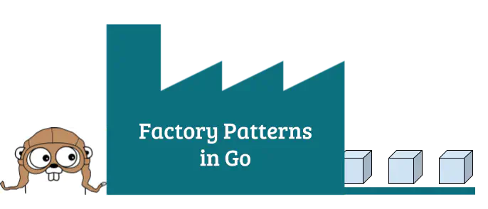

### Factory patterns in Go (Golang) 🏭

The factory pattern is a commonly used pattern in object oriented programming. In Go, there are many different ways in which you can use the factory pattern to make your code cleaner and more concise.



Go’s answer to classes, are structs. For example, the struct for a “Person”, along with a “Greet” method would look like this:

``` go
type Person struct {
  Name string
  Age int
}

func (p Person) Greet() {
  fmt.Printf("Hi! My name is %s", p.Name)
}
```
We can now make use of factory functions to create new instances of `Person`

#### Simple factory

The simplest, and most commonly used factory is a function that takes in some arguments, and returns an instance of `Person`:

``` go
func NewPerson(name string, age int) Person {
  return Person{
    Name: name,
    Age: age
  }
}
```
We can also return pointers to the `Person` instance instead:

``` go
func NewPerson(name string, age int) *Person {
  return &Person{
    Name: name,
    Age: age
  }
}
```
Factory functions are a better alternative to initializing instances using something like `p := &Person{}` because, the function signature ensures that everyone will supply the required attributes. For example, one can easily forget to initialize the `Age` attribute when using struct initialization. The function signature of `NewPerson(name string, age int)` ensures that both the name and age are supplied in order to construct a new instance of `Person`


###### 👉 Use factory functions to ensure that new instances structs are constructed with the required arguments.

#### Interface factories
Factory functions can return interfaces instead of structs. Interfaces allow you to define behavior without exposing internal implementation. This means we can make structs private, while only exposing the interface outside our package.

``` go
type Person interface {
  Greet()
}

type person struct {
  name string
  age int
}

func (p person) Greet() {
  fmt.Printf("Hi! My name is %s", p.name)
}

// Here, NewPerson returns an interface, and not the person struct itself
func NewPerson(name string, age int) Person {
  return person{
    name: name,
    age: age
  }
}
```
Since pointers can also implement interfaces, we can use the same function signature to return a pointer instead:
``` go
func NewPerson(name string, age int) Person {
  return &person{
    name: name,
    age: age
  }
}
```
#### Multiple implementations
By returning interfaces, we can have multiple factory functions returning different implementations of an interface. One practical use case is to generate mocks. For example, we can create an interface Doer that the standard go http client implements, and make a factory function to return a mock http client:

``` go
// We define a Doer interface, that has the method signature
// of the `http.Client` structs `Do` method
type Doer interface {
	Do(req *http.Request) (*http.Response, error)
}

// This gives us a regular HTTP client from the `net/http` package
func NewHTTPClient() Doer {
	return &http.Client{}
}

type mockHTTPClient struct{}

func (*mockHTTPClient) Do(req *http.Request) (*http.Response, error) {
	// The `NewRecorder` method of the httptest package gives us
	// a new mock request generator
	res := httptest.NewRecorder()

	// calling the `Result` method gives us
	// the default empty *http.Response object
	return res.Result(), nil
}

// This gives us a mock HTTP client, which returns
// an empty response for any request sent to it
func NewMockHTTPClient() Doer {
	return &mockHTTPClient{}
}
```
Since `NewHTTPClient` and `NewMockHTTPClient` both return the same type, they can be used interchangeably. This is especially useful for when you want to test the code using the HTTP client without actually making any external HTTP calls.

###### 👉 Use interface factories when you want to use multiple implementations interchangeably

Factory generators
Factory generators are factories of factories **…factoryception!** While this may seem a bit excessive, factory generators are incredibly useful, when you want to construct instances of different structs or interfaces that are not mutually exclusive, or if you want multiple factories with different defaults.

#### Factory methods
We can use methods of a factory generator struct as factories. For example, consider an animal factory, that creates instances of an animal, and also a place to house the animal:
``` go
type Animal struct {
	species string
	age     int
}

type AnimalHouse struct {
	name         string
	sizeInMeters int
}

type AnimalFactory struct {
	species   string
	houseName string
}

// NewAnimal is an `Animal` factory that fixes
// the species as the value of its `AnimalFactory` instance
func (af AnimalFactory) NewAnimal(age int) {
	return Animal{
		species: af.species,
		age:     age,
	}
}


// NewHouse is an `AnimalHouse` factory that fixes
// the name as the value of its `AnimalFactory` instance
func (af AnimalFactory) NewHouse(sizeInMeters int) {
	return Animal{
		name:         af.houseName,
		sizeInMeters: sizeInMeters,
	}
}
```
Now, we can make dog factories, and horse factories using the `AnimalFactory` generator:

``` go
dogFactory := AnimalFactory{
  species: "dog",
  houseName: "kennel"
}
dog := dogFactory.NewAnimal(2)
kennel := dogFactory.NewHouse(3)

horseFactory := AnimalFactory{
  species: "horse",
  houseName: "stable"
}
horse := horseFactory.NewAnimal(12)
stable := horseFactory.NewHouse(30)
```

###### 👉 Use factory methods to make factories that return inter-related instances of different structs or interfaces

#### Factory functions
We can use factory functions to make factories with some defaults built in. For example, if we want to make a “baby factory” and a “teenager factory” instead of a generic “person factory”, we use a generator function:

```go
type Person struct {
	name string
	age int
}

func NewPersonFactory(age int) func(name string) Person {
	return func(name string) Person {
		return Person{
			name: name,
			age: age,
		}
	}
}
```
We can then use this function to create factories with the default age built in:

``` go 
newBaby := NewPersonFactory(1)
baby := newBaby("john")

newTeenager := NewPersonFactory(16)
teen := newTeenager("jill")
```
The `age` attribute is now abstracted away in the `NewPersonFactory` closure.

###### 👉 Factory functions are useful when you want a factory to make specialized instances of a single struct.

#### When not to use factories
**Don’t get carried away!** Factories are something that can be easily overused. If you are initializing a struct, where the default values in Go are also sensible defaults for you, then a factory isn’t really going to help. For example, if we want to generate a counter:

``` go
type Counter struct {
  count int
}

func main(){
  c := Counter{}
}
```

The default value of `c.count` is `0`, which is perfectly acceptable! Creating a factory function for this would not do much. There are many examples in Go’s standard library as well: The default http.Client, and sync.WaitGroup, to name a few, are not initialized with factory functions.

In the end, factories should be used in cases where they add value, and hopefully this post will help you decide when that is.