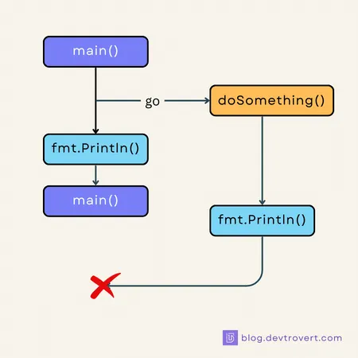

### Goroutines: A Basic Walkthrough

[based on this article](https://blog.devtrovert.com/p/goroutines-think-you-know-go-basics)

Goroutines are the heart of Golang, with the efforts of the Go Team, developers can handle tasks concurrently using just the ‘go’ keyword

#### Concurrency Series
Goroutines 102: A Basic Walkthrough

Go Channels Explained: More than Just a Beginner’s Guide.

Select & For Range Channel in Go: Breaking Down

Goroutine Scheduler Revealed: Never See Goroutines the Same Way Again

Goroutines truly define Golang and thanks to the diligent Go Team, we, the developers, can concurrently manage tasks concurrently with just a sprinkle of the ‘go’ keyword

```go
func main() {
  go TaskA()
}
```

Simple, right? Think about other languages for a moment.

Java, we’re often navigating through Thread and ExecutorService frameworks, and in Python? Threading can get tied up with the Global Interpreter Lock (GIL).

But with Go, things just click and it just works.

1. #### Goroutines The First Look
Before diving into the inner workings of goroutines, let’s get familiar with its basic usage:

```go
func main() {
  go doSomething()

  fmt.Println("done")
}

func doSomething() {
  fmt.Println("doSomething called")
}

// done
```

In the example above, doSomething() will be executed concurrently with main(), and thanks to the built-in go keyword, there’s no fuss with external libraries or any of that sort.

**“But wait, why am I not seeing the log ‘doSomething called’?”**


Ah, there’s a catch.

main() doesn’t wait for the goroutines it launches to complete. So, when you run the program, main() briskly starts doSomething() as a goroutine and without missing a beat, prints ‘done’.

The program might wrap up and say its goodbyes even before doSomething() gets call.





You can give the doSomething goroutine a moment to finish its task in the main function by adding a simple time.Sleep(..):

```go
func main() {
  go doSomething()
  
  time.Sleep(time.Second)
  fmt.Println("done")
}

func doSomething() {
  fmt.Println("doSomething called")
}

// doSomething called
// done
```

For those seeking a more polished solution, have a glance at this article: 6 Essential sync Package Concepts. It’ll guide you on leveraging the sync.WaitGroup.

And there you have it, the basics of using a goroutine, but the question remains: “Why did Go favor goroutines over other techniques like traditional threads?”.

Let’s delve into that next.


2. #### Goroutines, Threads and CPU Cores
Goroutines have a special place, all thanks to Go’s runtime. We, as developers, don’t need to worry about OS threads; Go does that for us

Why goroutines over OS threads
When you stack up goroutines and OS threads side by side, some differences come to light:

Size: By default, a goroutine is small, starting at just 2KB. It can grow based on what it needs, but it’s still much smaller than threads, which can be a few kilobytes to megabytes, depending on the system.

Creation: OS threads take more resources to start, but goroutines are easy to create.

Schedule: Goroutines have their own scheduler, which uses an m:n strategy for goroutines and threads. In contrast, threads rely on the OS kernel.

Context Switching: Switching between tasks is quicker with goroutines, that’s why they can handle thousands at the same time.

Identity: Goroutines don’t have IDs, while threads do.

Communication: Goroutines use channels to communicate, but threads use more traditional methods like mutexes, semaphores, and conditional variables,…

Behind the scenes, n goroutines are mapped onto m OS threads, and this is done without the developers even knowing.

“Is this approach new, or do other languages do something similar?”

No, concurrency models like this aren’t exclusive to Go.

For example, Erlang uses lightweight processes and has a way of handling concurrency that’s a lot like Go. On the other hand, languages like Java, C#, and Python typically map user-level threads directly to kernel-level threads (Correct me).

Goroutine and CPU Cores
When I first dived into Go, I was curious about the relationship between goroutines and CPU cores. So, I started with a simple exercise to figure out how many logical cores can handle Go code at the same time:

```go
func main() {
  fmt.Println(runtime.NumCPU())
  fmt.Println(runtime.GOMAXPROCS(0))
}

// 8
// 8
```

On my Macbook Pro, there are 8 CPU cores, also known as logical cores. By default, my Go applications take full advantage of all of them, evident from GOMAXPROCS showing 8.

**“Why the 0 in runtime.GOMAXPROCS?”**

Well, GOMAXPROCS tells us the max number of CPUs that can work with Go code at once. We can adjust this value, but when you put in a value less than 1, it merely returns the current setting without making changes.

**“What happens when I switch GOMAXPROCS between 1 and 8?”**
Each CPU core can run one goroutine at a given time, so if it’s set to 1, then goroutines are processed one by one, though the sequence might surprise you.

For a clearer picture, let’s get hands-on:

```go
var wg sync.WaitGroup

func main() {
  runtime.GOMAXPROCS(1) // Limiting to 1 CPU core
  
  wg.Add(3)
  go doSomething(10)
  go doSomething(10)
  go doSomething(10)
  
  wg.Wait()
}

func doSomething(n int) {
  defer wg.Done()

  for i := 0; i < n; i++ {
    fmt.Print(i)
  }
}
```

In this setup, each goroutine prints numbers from 0 to 9 and with GOMAXPROCS set to 1, the output is organized, like a queue:

```bash
0123456789 0123456789 0123456789
```

However, if you let the system use all available cores by removing the runtime.GOMAXPROCS(1) line, the output gets a bit more lively:

```bash
0123401234 5656789701 2345678989
```

The numbers overlap, showcasing true concurrency.

Occasionally, they might appear in order due to the short range (0 to 9), but playing with bigger numbers or running the test multiple times can give varied results.

#### Race Condition
Race conditions might seem like a familiar topic, as they’re a common challenge across many programming languages and systems but I’ll touch on the basics and then dive deeper into its peculiarities in Go.

##### When Does a Race Condition Occur?
Race conditions crop up when several goroutines access shared data without proper synchronization. This lack of coordination can spawn unpredictable outcomes, elusive bugs, and even system crash.

```go
var counter = 0
var wg = sync.WaitGroup{}

func AddCounter() {
  defer wg.Done()
  counter++
}

func main() {
  for i := 0; i < 2000; i++ {
    wg.Add(1)
    go AddCounter()
  }
  
  wg.Wait()
  fmt.Println(counter) // ?
}
```

Here I’m firing up 2000 goroutines, each of them nudges the counter up by 1.

But here’s the twist, the final output isn’t the straightforward 2000. Well, not unless you’re sticking to just one logical core with runtime.GOMAXPROCS(1), like we chatted about earlier.

Each run can show a slightly different number, and if you ramp up the logical cores in use, that variance widens. On my setup with 8 logical cores, I got a reading of 1896.

**“Hold on, I thought operations like ++ were atomic. Doesn’t something like MongoDB treat it as a single, undivided action?”**

Yes and no.

The ++ operation actually involves several steps under the hood. If you’re curious about the inner workings, I’ve delved into the topic in another article titled “Why Your Go Counter Isn’t Counting Right: sync/atomic Uncovered”.

Basically, even when you see a line of code , it often carries more weight than you’d initially think.

MongoDB’s atomic operations, like $inc, are atomic at the database level, while they involve multiple CPU instructions, the database’s concurrency controls ensure they’re atomic.

#### Potential Crashes in Concurrency
At times, accessing the same resource with multiple goroutines can lead to crashes. Consider the example below:

```go
func main() {
  var wg sync.WaitGroup
  var myMap = map[int]int{1: 1, 2: 2, 3: 3}
  
  for i := 0; i < 100; i++ {
    wg.Add(1)
    go func() {
      defer wg.Done()
      
      myMap[i] = i
    }()
  }
  
  wg.Wait()
  fmt.Println("done")
}
```

Running this snippet, you are likely to encounter: fatal error: concurrent map writes. Go will terminate if there are concurrent read-write or write-write operations on the map.

**“So, reading from a map concurrently is okay?”**

Exactly.

**“And is there a way to recover from such errors?”**

Unfortunately, not in this case.

These crashes are intentional on the part of Go runtime and it’s a fatal error, not a panic, meaning recovery isn’t an option. To circumvent such situations, you have various sync techniques at your disposal like sync.RWMutex or sync.Map, which I’ve discussed in a previous post.

A handy tip alert, running your application with go run -race main.go can help you pinpoint potential race condition issues in your code.

By the way, you might have missed the little pitfall where the goroutines captures the i variable from the for loop in our example above and it's a common oversight when using goroutine.

The correct way to fix the loopvar issue (this issue was fixed in Go 1.22) is:

```go
for i := 0; i < 100; i++ {
  i := i // <--- HERE
  wg.Add(1)
  go func() {
    defer wg.Done()
    
    myMap[i] = i
  }()
}
```
This can still crash if your goroutine concurrently writes to a map. To handle this, you can use various synchronization techniques introduced here:
