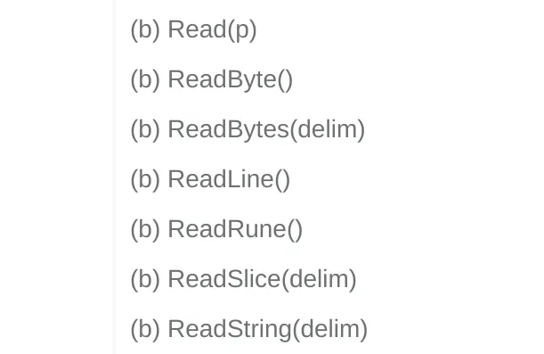

Moving data around is one of the most common things you do when programming. That’s why no matter the language you use, you must master handling the data flow.

### Everything is a bunch of bytes
Someone was complaining on Linkedin that it’s confusing that len gives the number of bytes, not the number of characters of a string:

```go
package main

import "fmt"

func main() {
    str := "ana"
    fmt.Println(len(str)) // 3
    str = "世界"
    fmt.Println(len(str)) // 6 not 2
}
```
This may be confusing to someone because of the wrong mental model. In computing, every piece of data is just a series of bytes. If you want its length, then you need the number of bytes, not the number of interpreted things in that data.

If I load the below image in Go and run len on the data, I will not get 1 because there’s 1 cat in the picture, but 293931 because the image has 293931 bytes.

###### Remember: every piece of data you are manipulating, whether that’s a string, an image, or a file is just a bunch of bytes.

Readers and Writers
Data movement comprises two fundamental parts: reading and writing. You read from somewhere, apply some transformations or whatnot, and later on, you write that final data somewhere.

Because reading and writing are fundamental operations, Go offers us two abstractions: io.Reader and io.Writer. From here on, for the sake of readability, I will refer to them as Reader and Writer.

Remember: a Reader is something you can read from, and a Writer is something you can write to.

I emphasized that because when I started with Go, this naming confused me.
When I hear about a writer, I think of someone who writes. But in Go, a Writer is something you can write to.

When working with I/O in Go, you don’t care what something is, but whether you can read from it or write to it.
As long as it implements the Reader interface, you can read from it, and if it implements the Writer interface, you can write to it.

If you have some bytes, you can write them to any Writer. It doesn’t matter if the bytes represent a file, a network connection, an HTTP response, or something else.

The minimal I/O toolkit
Now let’s add the first types and functions to our toolset as promised.

#### bytes.Buffer
As I said above, every piece of data is just a bunch of bytes. Usually, that’s represented as a`[]byte`, but the slice of bytes does not implement Reader and Writer interfaces.

One type I often use is the `bytes.Buffer` because it’s like a `[]byte` that implements both Reader and Writer interfaces simplifying reading and writing to it.

#### io.Copy
Do you have a Reader and want to copy its contents to a Writer? io.Copy does the trick!

Bellow we create a buffer, add a string in it, and then copy that data to `os.Stdout` which is just a file in the end:

```go
package main
import (
    "bytes"
    "io"
    "os"
)
func main() {
    var buf bytes.Buffer
    buf.WriteString("hello world\n")

    io.Copy(os.Stdout, &buf)
}
```

#### fmt.Fprint
Sometimes you just want to print some strings to a Writer. For this, you can use fmt.Fprint% functions:

```go
package main

import (
    "bytes"
    "fmt"
    "os"
)

func main() {
    var buf bytes.Buffer

    // Fprintf can be called to print a string to any io.Writer

    fmt.Fprintf(&buf, "hello world!")         // on bytes.Buffer
    fmt.Println(buf.String())

    fmt.Fprintf(os.Stdout, "hello world!\n")  // on a *os.File
}
```

##### example for server health check

```go
package handlers

import (
    "fmt"
    "net/http"
)

func HealthHandler() http.Handler {
    return http.HandlerFunc(
       func(w http.ResponseWriter, r *http.Request) {
          fmt.Fprintln(w, "OK") // write OK string to response body
       },
    )
}
```

#### io.ReadAll
This method is useful when you want to read all bytes from a certain Reader:

``` go
package main

import (
    "fmt"
    "io"
    "strings"
)

func main() {
    r := strings.NewReader("Hello World!")

    data, _ := io.ReadAll(r)

    fmt.Println(data)         // [72 101 108 108 111 32 87 111 114 108 100 33]
    fmt.Println(string(data)) // Hello World!
}
```

If you’re dealing with a huge file, it might not always be a good idea to read the full content at once. We will see in future posts what alternatives we have. However, io.ReadAll is a very handy function to have in your toolkit.

##### Conclusion
To recap, here’s the most important information covered in this article:

At the fundamental level, every piece of data is just a bunch of bytes.

Most of what we do when programming is moving data around.

Moving data is composed of two parts: reading and writing. Go offers us io.Reader and io.Writer abstractions for these operations.

A Reader is something you can read from, and a Writer is something you can write to.

As long as something implements io.Reader you can read from it and if it implements io.Writer you can write to it.

We also added a bunch of useful types and functions to our toolkit:

`io.Reader and io.Writer`
`bytes.Buffer`
`io.Copy`
`fmt.Fprintf and fmt.Fprintln`
`io.ReadAll`


##### io.LimitReader

Sometimes, you want to limit the number of bytes you read from a piece of data.

To limit the size of data you read, you can wrap that data source (Reader) with an io.LimitReader function that returns another Reader from which you can read only n bytes:

``` go
package main

import (
    "io"
    "log"
    "os"
    "strings"
)

func main() {
    r := strings.NewReader("Hello!")

    lr := io.LimitReader(r, 4)

    // Ouput: Hell
    if _, err := io.Copy(os.Stdout, lr); err != nil {
        log.Fatal(err)
    }
}
```

##### io.MultiReader

Sometimes, you can have multiple data sources, and you want to treat those sources as one. If you have multiple Readers, you can merge them into one Reader with io.MultiReader:

``` go
package main

import (
    "io"
    "log"
    "os"
    "strings"
)

func main() {
    r1 := strings.NewReader("first reader\n")
    r2 := strings.NewReader("second reader\n")
    r3 := strings.NewReader("third reader\n")

    // merge all 3 readers into one
    r := io.MultiReader(r1, r2, r3)

    if _, err := io.Copy(os.Stdout, r); err != nil {
       log.Fatal(err)
    }

}
```
I recently used io.MultiReader, when I needed to write the bytes coming from different requests into one file in a parallel downloader implementation:

``` go 
results := make([]io.Reader, n)
// ...
if err := writeToFile(destinationFileName, io.MultiReader(results...)err != nil {
 return fmt.Errorf("could not write to file: %w", err)
}
```

##### io.MultiWriter

Similar to io.MultiReader, we have an io.MultiWriter function, which creates a writer that reproduces its writes to all the provided writers:
``` go 
package main

import (
    "bytes"
    "fmt"
    "io"
    "strings"
)

func main() {
    var (
       buf1 bytes.Buffer
       buf2 bytes.Buffer
    )

    // writing into mw will write to both buf1 and buf2
    mw := io.MultiWriter(&buf1, &buf2)

    // r is the source of data(Reader)
    r := strings.NewReader("some io.Reader stream to be read")

    // write to mw from r
    io.Copy(mw, r)

    fmt.Println("data inside buffer1 :", buf1.String())
    fmt.Println("data inside buffer2 :", buf2.String())

}
```

I like to use `io.MultiWriter` when I'm trying to debug what was written in a certain Writer.
If a function writes to a Writer and, for some reason, it is too hard to get those contents, I connect a `bytes.Buffer` to it, and then I check the contents of the buffer, which will be the same as the contents of my inaccessible Writer:

``` go
package main

import (
    "bytes"
    "fmt"
    "io"
)

func main() {
    buf := new(bytes.Buffer)
    weirdWriter := new(bytes.Buffer)

    debug := io.MultiWriter(buf, weirdWriter) // attach buf to weirdWriter

    complicatedFunctionWithAWriter(debug) // a function what normally used weirdWriter

    // The contents of the buffer will be the same as in weirdWriter
    fmt.Println(buf.String())
    fmt.Println(buf.Bytes())

}

func complicatedFunctionWithAWriter(w io.Writer) {
    fmt.Fprintf(w, "i'm writing something")
}
```

##### io.TeeReader

Imagine reading and writing data in a place, and you want to write the same data somewhere else.

In the above image, we read from R to W and write to an extra Logs Writer at the same time.

Let’s see how that looks in code:
``` go 
package main

import (
    "bytes"
    "fmt"
    "io"
    "os"
    "strings"
)

func main() {
    logs := new(bytes.Buffer)

    data := strings.NewReader("Hello World!\n")

    teeReader := io.TeeReader(data, logs)

    // logs will also receives contents from teeReader
    io.Copy(os.Stdout, teeReader)

    fmt.Println("Content of logs:", logs.String())
}
```

##### io.Pipe

Speaking of Linux and plumbing, you might be familiar with the pipe operator, which combines two or more commands so that the output of one becomes the input of the other.

``` sh
echo hello | tr l y
```
This outputs:

``` sh 
heyyo
```
I like the pipe's universality. It doesn't matter what programs you connect as long as one writes and the other reads. I could have just as easily used `cat` to fetch the contents of a file instead of `echo`:

``` sh
cat file | tr l y
```
In Go, we achieve this behavior with io.Pipe that can be used to connect code expecting an io.Reader with code expecting an io.Writer.

Let's try to replicate the same `echo hello | tr l y` example to see how that works:

``` go
package main

import (
    "fmt"
    "io"
    "strings"
)

func main() {
    pipeReader, pipeWriter := io.Pipe()

    echo(pipeWriter, "hello")
    tr(pipeReader, "e", "i")
}

func echo(w io.Writer, s string) {
    fmt.Fprint(w, s)
}

func tr(r io.Reader, old string, new string) {
    data, _ := io.ReadAll(r)
    res := strings.Replace(string(data), old, new, -1)
    fmt.Println(res)
}
```
Running this program, we get an error:

``` sh
fatal error: all goroutines are asleep - deadlock!
```

To understand why, we need to read the documentation of the io.Pipe function:

``` sh
// Pipe creates a synchronous in-memory pipe.
// That is, each Write to the [PipeWriter] blocks until it has satisfied
// one or more Reads from the [PipeReader] that fully consume
// the written data.
```

Our code is not synchronous but sequential: we call `echo` and then `tr`. We get a deadlock when we try to write because no reading is happening.

Let's fix that:

``` go
package main

import (
    "fmt"
    "io"
    "strings"
)

func main() {
    pipeReader, pipeWriter := io.Pipe()

    // Run echo concurrently with tr in a separate goroutine
    go echo(pipeWriter, "hello")
    tr(pipeReader, "e", "i")
}

func echo(w io.Writer, s string) {
    fmt.Fprint(w, s)
}

func tr(r io.Reader, old string, new string) {
    data, _ := io.ReadAll(r)
    res := strings.Replace(string(data), old, new, -1)
    fmt.Println(res)
}
```

Running the modified program gives us the same error:

``` go
fatal error: all goroutines are asleep - deadlock!
```
Why is that? Let's check the `PipeReader` documentation on the Read method:

``` go 
// Read implements the standard Read interface:
// it reads data from the pipe, blocking until a writer
// arrives or the write end is closed.
// If the write end is closed with an error, that error is
// returned as err; otherwise err is EOF.
func (r *PipeReader) Read(data []byte) (n int, err error) {
    return r.pipe.read(data)
}
```

The second part of this sentence is key: blocking until a writer arrives or the write-end is closed.

The read is still blocked because the writer is not closed after writing our data. Let's fix that by calling `Close()` on the `pipeWriter`:

``` go
package main

import (
    "fmt"
    "io"
    "strings"
)

func main() {
    pipeReader, pipeWriter := io.Pipe()

    go func() {
       echo(pipeWriter, "hello")
       // we close the writer so we unblock the reader
       pipeWriter.Close()
    }()
    tr(pipeReader, "e", "i")
}

func echo(w io.Writer, s string) {
    fmt.Fprint(w, s)
}

func tr(r io.Reader, old string, new string) {
    data, _ := io.ReadAll(r)
    res := strings.Replace(string(data), old, new, -1)
    fmt.Println(res)
}
```

#### System calls: what are they?
When programs want to do something(e.g., open a file, send data via the network, create a process, etc.), they ask the operating system to do it via system calls(syscalls).

System calls are the API provided by the operating system to programs so they can manage resources.

These system calls are similar to regular function calls, but they involve some extra steps that cause the CPU to switch from user mode to kernel mode so it can execute a privileged action.

##### System calls: how can we see them?
`strace` is a Linux utility that lets you inspect the system calls performed by your program under the hood.

You run it with `strace` followed by the program you want to trace.

Say you want to trace the pwd program. `strace pwd` displays all the system calls performed by `pwd`:

``` sh
execve("/usr/bin/pwd", ["pwd"], 0x7ffd23593820 /* 71 vars */) = 0
brk(NULL)                               = 0x61cc90c5f000
arch_prctl(0x3001 /* ARCH_??? */, 0x7fff64ee0a80) = -1 EINVAL (Invalid argument)
mmap(NULL, 8192, PROT_READ|PROT_WRITE, MAP_PRIVATE|MAP_ANONYMOUS, -1, 0) = 0x71c13fd72000
access("/etc/ld.so.preload", R_OK)      = -1 ENOENT (No such file or directory)
openat(AT_FDCWD, "/etc/ld.so.cache", O_RDONLY|O_CLOEXEC) = 3
newfstatat(3, "", {st_mode=S_IFREG|0644, st_size=79587, ...}, AT_EMPTY_PATH) = 0
mmap(NULL, 79587, PROT_READ, MAP_PRIVATE, 3, 0) = 0x71c13fd5e000
close(3)                                = 0
openat(AT_FDCWD, "/lib/x86_64-linux-gnu/libc.so.6", O_RDONLY|O_CLOEXEC) = 3
----
getcwd("/home/andrei", 4096)            = 13
newfstatat(1, "", {st_mode=S_IFCHR|0620, st_rdev=makedev(0x88, 0x3), ...}, AT_EMPTY_PATH) = 0
write(1, "/home/andrei\n", 13/home/andrei
)          = 13
close(1)                                = 0
close(2)                                = 0
exit_group(0)                           = ?
```

This output can be pretty verbose because, most of the time, you don't want to see all the syscalls. You can filter for a specific syscall by using the `-e `option.
For example, to see only the `write` system calls we run:

``` sh
strace -e write pwd
```
Running this on my home directory, I get the following output:
``` sh
write(1, "/home/andrei\n", 13/home/andrei
)          = 13
+++ exited with 0 +++
```

which means that the 13 bytes of`/home/andrei\n` are successfully written to file with the descriptor 1 (the standard output in Linux). That's all you need to know for this article, but if you want to learn more, check out this zine made by Julia Evans.

I like `strace` because it helps me see what a program is doing even if I can't access the source code. Some people call `strace` the Sysadmin's Microscope, but I view it more as a stethoscope. A compiled program is like a black box, but that doesn't mean we cannot hear what's inside with the help of `strace`.
Now that we know what system calls are and how to trace them let's examine buffered I/O.

#### Buffered I/O
System calls are expensive due to their extra steps, so it's a good idea to decrease them.

Buffered I/O minimizes the number of system calls when doing I/O operations by temporarily storing the data we read/write inside a buffer.

In real life, we use buffers all the time. We don't wash one piece of clothing at a time. Instead, we collect all the clothes in a laundry basket(buffer), and when it's full, we put them in the washing machine and wash them all in one go.


bufio is the package from the standard library that helps us with buffered I/O.

You should not think that the functions from the `io` package covered in Part One don't use buffering because some do. If we check `io.Copy`, for example, we see that a buffer is internally allocated. What `bufio` gives us extra are convenient tools for more control over the buffering.

Let's cover the three main types from the `bufio` package: `bufio.Writer`, `bufio.Reader` and `bufio.Scanner`.

#### bufio.Writer
Let's see some writes without buffering:
``` go
package main

import (
    "os"
)

func main() {
    f := os.Stdout // f is a *os.File thus an io.Writer

    f.WriteString("a")
    f.WriteString("b")
    f.WriteString("c")
}
```
If we compile this program as `writer_file` and `run strace -e write ./writer_file`, we get this output containing 3 `write` system calls:

``` sh
--- SIGURG {si_signo=SIGURG, si_code=SI_TKILL, si_pid=61172, si_uid=1000} ---
write(1, "a", 1a)                        = 1
write(1, "b", 1b)                        = 1
write(1, "c", 1c)                        = 1
+++ exited with 0 +++
```
Now let's try the same code with a buffered writer created by putting the `f` `io.Reader` in the `bufio.NewWriter(f)` function:


``` go
package main

import (
    "bufio"
    "os"
)

func main() {
    f := os.Stdout

    w := bufio.NewWriter(f)

    w.WriteString("a")
    w.WriteString("b")
    w.WriteString("c")

    // Perform 1 write system call
    w.Flush()
}
```
We see the same behavior, but if we run the `strace` with this compiled program, we have 1 write instead of 3:

``` sh
--- SIGURG {si_signo=SIGURG, si_code=SI_TKILL, si_pid=61488, si_uid=1000} ---
write(1, "abc", 3abc)                      = 3
+++ exited with 0 +++
```

We can see how wrapping an `io.Writer` into a `bufio.NewWriter `decreases the number of system calls and how easy is to apply buffering by putting an `io.Writer` inside only one function.

The reason we had to call `w.Flush()` was because the `bufio.NewWriter `function creates a Writer with a default size of 4096 bytes:

``` go
// NewWriter returns a new [Writer] whose buffer has the default size.
// If the argument io.Writer is already a [Writer] with large enough buffer size,
// it returns the underlying [Writer].
func NewWriter(w io.Writer) *Writer {
    return NewWriterSize(w, defaultBufSize)
}
```

If data is less than the buffer size, it won’t get written unless we call `.Flush()`. In our case, we had 3 bytes(abc) < 4096 bytes.

You can customize the size of the buffer by calling NewWriterSize.

In the following example, with a buffer of 3 bytes, `abc` are printed when we add `d`. Once we add `d`, we need to call the `Flush()`to get it printed because we still have space in the buffer.

``` go
package main

import (
    "bufio"
    "os"
)

func main() {
    f := os.Stdout

    w := bufio.NewWriterSize(f, 3)

    // Will print abc. d is added the buffer and will not be printed without an explicit .Flush()
    w.WriteString("a")
    w.WriteString("b")
    w.WriteString("c")
    // -----------------
    w.WriteString("d")
}
```

When adding data to a buffer, there are 3 scenarios:


The buffer has available space -> Data is added to the buffer.
The buffer is full -> Flush(write) the buffer's content into the `io.Writer`, and add any new data to the buffer.
The data exceeds the size of the buffer -> Skip the buffer and add data straight to the destination.

``` go
package main

import (
    "bufio"
    "fmt"
)

type Writer int

// Writer implements io.Writer interface
func (w *Writer) Write(p []byte) (n int, err error) {
    fmt.Printf("Writing: %s\n", p)
    return len(p), nil
}

func main() {
    bw := bufio.NewWriterSize(new(Writer), 4)

    bw.Write([]byte{'a'}) // buffer has space
    bw.Write([]byte{'b'}) // buffer has space
    bw.Write([]byte{'c'}) // buffer has space
    bw.Write([]byte{'d'}) // buffer has space

    bw.Write([]byte{'e'}) // buffer is full. flush `abcd` and add `e` to the buffer

    bw.Flush() // flush `e` to underlying Writer

    bw.Write([]byte("abcdefghij")) // `abcdefghij` is bigger than 4 so we flush all to underlying Writer
}
```
#### bufio.Reader
bufio.Reader is similar to `bufio.Writer`, but instead of buffering data before writing, it buffers data fetched from `read` system calls, allowing us to read more data in a single read operation.

If we have an `io.Reader`, we can create a `bufio.Reader` from it by calling the `bufio.NewReader()` function with that `io.Reader` as argument:

``` go
var r io.Reader
bufferedReader := bufio.NewReader(r)
```
Once we have our buffered reader, we can call several read methods on it, such as:





It's important to remember that any `read` system call from a buffered reader happens in chunks equal to its internal buffer.
For example, in the following program, we read 4096 bytes at a time, even though we get one byte at a time from the internal buffer:

``` go 
package main

import (
    "bufio"
    "fmt"
    "io"
    "log"
    "os"
)

func main() {
    fileName := "input.txt"
    file, err := os.Open(fileName)
    if err != nil {
       log.Fatalf("Error opening file: %v", err)
    }
    defer file.Close()

    reader := bufio.NewReader(file)

    var bytesRead int64
    for {
       _, err := reader.ReadByte()
       if err != nil && err != io.EOF {
          log.Fatalf("Error reading file: %v", err)
       }
       if err == io.EOF {
          break
       }
       bytesRead++
    }

    fmt.Printf("Total bytes read with bufio.Reader: %d\n", bytesRead)
}
```

If we export the output of `strace` , we will see a bunch of lines like these:

``` go
read(3, "The quick brown fox jumps over t"..., 4096) = 4096
read(3, "he quick brown fox jumps over th"..., 4096) = 4096
read(3, "e quick brown fox jumps over the"..., 4096) = 4096
read(3, " quick brown fox jumps over the "..., 4096) = 4096
```
These lines show that we call `read` system call every 4096 bytes and not for each byte, even though looking at the method name,`ReadByte()`, you would think we perform a `read` for each byte.

That’s the cool stuff about the buffered reader: even if we read smaller chunks in our code, we read from the internal buffer as long as it has elements.

Same as with `bufio.Writer`, the default buffer size of `bufio.Reader` is 4096 bytes. If we want to change it, we have the NewReaderSize function.

#### bufio.Scanner
The bufio.Scanner is used to read a stream of data by tokens. Tokens are defined by what separates them. For example, words are tokens split by space, sentences by dots, or lines split by `\n` character.

Here is an example that reads a file line by line:
``` go
package main

import (
    "bufio"
    "fmt"
    "log"
    "os"
)

func main() {
    f, err := os.Open("input.txt")
    if err != nil {
       log.Fatal(err)
    }
    defer f.Close()

    s := bufio.NewScanner(f)
    for s.Scan() {
       fmt.Println(s.Text())
    }

    if err = s.Err(); err != nil {
       fmt.Fprintln(os.Stderr, "reading standard input:", err)
    }
}
```
A split function defines the tokens. By default, the `bufio.Scanner` uses ScanLines split function, which splits tokens into lines.
The standard library offers `ScanRunes`, `ScanWords`, and `ScanBytes` split functions, and you set a split function by calling the `.Split()` method on the scanner:

``` go 
package main

import (
    "bufio"
    "fmt"
    "log"
    "os"
)

func main() {
    f, err := os.Open("input.txt")
    if err != nil {
       log.Fatal(err)
    }
    defer f.Close()

    s := bufio.NewScanner(f)
    
    s.Split(bufio.ScanWords) // use words as tokens
    
    for s.Scan() {
       fmt.Println(s.Text())
    }

    if err = s.Err(); err != nil {
       fmt.Fprintln(os.Stderr, "reading standard input:", err)
    }
}
```

If the split functions from the standard library don't suffice, you can create your own as long as they match the SplitFunc signature:

For example, here is an implementation that splits content by the `+` sign:

``` go
package main

import (
    "bufio"
    "bytes"
    "fmt"
    "log"
    "strings"
)

func main() {
    r := strings.NewReader("a+b+c+d+e")

    s := bufio.NewScanner(r)
    s.Split(CustomSplit) // set our CustomSplit function to scanner

    for s.Scan() {
       fmt.Println(s.Text())
    }

    if err := s.Err(); err != nil {
       log.Fatalf("error on scan: %s", err)
    }

}

func CustomSplit(data []byte, atEOF bool) (advance int, token []byte, err error) {
    if atEOF && len(data) == 0 {
       return 0, nil, nil
    }

    if i := bytes.IndexRune(data, '+'); i >= 0 {
       return i + 1, data[0:i], nil
    }

    if atEOF {
       return len(data), data, nil
    }

    return 0, nil, nil
}
```
This example is overkill and used only for showcase. When you have a string, you should use the strings.Split() function, or bytes.Split() if you're dealing with bytes. Use `bufio.Scanner` only when you deal with files or other data streams, not strings or slices of bytes.

We can see that this `bufio.Scanner` is a very specialized type of buffered reader that sees data as information split by tokens, and for most cases, you can go with it, but sometimes, when you need more control, you should go with the `bufio.Reader` instead, as the std library suggests:


###### Scanning stops unrecoverably at EOF, the first I/O error, or a token too large to fit in the Scanner.Buffer. When a scan stops, the reader may have advanced arbitrarily far past the last token. Programs that need more control over error handling or large tokens, or must run sequential scans on a reader, should use bufio.Reader instead.

