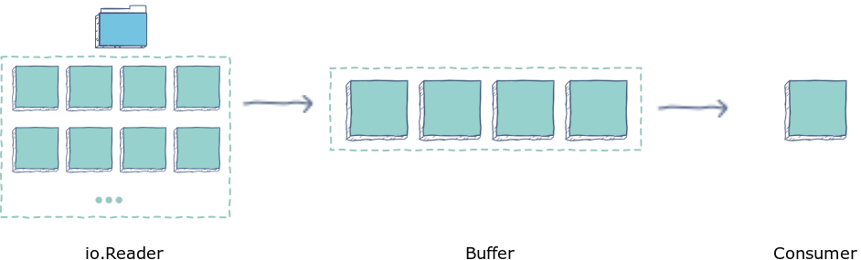

In Golang, `bufio` is a package used for **buffered IO**. Buffering IO is a technique used to temporarily accumulate the results for an IO operation before transmitting it forward. This technique can increase the speed of a program by reducing the number of system calls, which are typically slow operations. In this shot, we will look at some of the abstractions bufio provides for writing and reading operations.

#### Writing with bufio


With `bufio`, we can use the `bufio.Writer` method to accumulate data into a buffer before writing to IO. In the example below, we have demonstrated three likely situations that you may encounter:

1. The buffer is full
2. The buffer has space after a write
3. A write larger than buffer capacity is made

#### 1. The buffer is full
As soon as the buffer is full, the write operation takes place.

#### 2. The buffer has space after write
If the buffer still has space after the last write, it will not attempt to complete that write until specifically urged to do so by the `Flush()` method.

#### 3. A write larger than buffer capacity is made
If a write is larger than buffer capacity,​ the buffer is skipped because there is no need to buffer.

``` go 
package main
import (
    "fmt"
    "bufio"
)

// Writer type used to initialize buffer writer
type Writer int
func (*Writer) Write(p []byte) (n int, err error) {
    fmt.Printf("Writing: %s\n",p)
    return len(p), nil
}

func main() {
  // declare a buffered writer 
  // with buffer size 4
  w := new(Writer)
  bw := bufio.NewWriterSize(w, 4)


  // Case 1: Writing to buffer until full
  bw.Write([]byte{'1'})
  bw.Write([]byte{'2'})
  bw.Write([]byte{'3'})
  bw.Write([]byte{'4'}) // write - buffer is full


  // Case 2: Buffer has space
  bw.Write([]byte{'5'})
  err := bw.Flush() // forcefully write remaining
  if err != nil {
    panic(err)
  }


  // Case 3: (too) large write for buffer 
  // Will skip buffer and write directly
  bw.Write([]byte("12345"))
}
``` 
or simply you can use `os.Stdout` as a writer:

``` go 
package main

import (
	"bufio"
	"os"
)

func main() {
	// declare a buffered writer
	// with buffer size 4
	w := os.Stdout
	bw := bufio.NewWriterSize(w, 4)

	// Case 1: Writing to buffer until full
	bw.Write([]byte{'1'})
	bw.Write([]byte{'2'})
	bw.Write([]byte{'3'})
	bw.Write([]byte{'4'}) // write - buffer is full

	// Case 2: Buffer has space
	bw.Write([]byte{'5'})
	err := bw.Flush() // forcefully write remaining
	if err != nil {
	    panic(err)
	}

	// Case 3: (too) large write for buffer
	// Will skip buffer and write directly
	bw.Write([]byte("12345"))
}
```

### Miscellaneous write features

#### Re-use
We can re-use the same `bufio.NewWriterSize` for different writers using the `reset()` method:


``` go 
writerOne := new(Writer)
bw := bufio.NewWriterSize(writerOne,2) 
writerTwo := new(Writer)
bw.Reset(writerTwo)
```
here is the real world example

``` go 
package main

import (
	"bufio"
	"os"
)

func main() {
	// declare a buffered writer
	// with buffer size 4
	w := os.Stdout
	bw := bufio.NewWriterSize(w, 40)
    
	file, err := os.OpenFile("data.txt", os.O_RDWR|os.O_CREATE|os.O_TRUNC, 0666)
	if err != nil {
		panic(err)
	}

	bw.Reset(file)

	bw.Write([]byte("12345"))
}
```

#### Check available space
We can check available space with the `Available() `method.


``` go 
package main

import (
	"bufio"
	"fmt"
	"os"
)

func main() {
	file, err := os.OpenFile("data.txt", os.O_RDWR|os.O_CREATE|os.O_TRUNC, 0666)
	if err != nil {
		panic(err)
	}
	defer file.Close()

	bw := bufio.NewWriterSize(file, 40)

	bw.Write([]byte("12345"))

	fmt.Println(bw.Available())
}
```
``` sh 
35
```

### Reading with `bufio`




`bufio` allows us to read in batches with `bufio.Reader` uses `io.Reader` under the hood. After a read, data is released, as required, from the buffer to the consumer. In the example below, we will look at:

1. Peek
2. ReadSlice
3. ReadLine
4. ReadByte
5. Scanner


#### 1. Peek
The `Peek` method lets us see the first -n- bytes (referred to as peek value) in the buffer without consuming them. The method operates in the following way.

1. If the peek value is less than buffer capacity, the characters equal to the peek value are returned.

``` go 
package main

import (
	"bufio"
	"fmt"
	"strings"
)

const str = "The Peek method lets us see the first -n- bytes (referred to as peek value) in the buffer without consuming them. "

func main() {
	fmt.Println("length of reader is", len(str))

	stringReader := strings.NewReader(str)

	br := bufio.NewReaderSize(stringReader, len(str))

	dataByte, err := br.Peek(15)
	if err != nil {
		panic(err)
	}

	fmt.Printf("The Peek(15) output is %q \n", string(dataByte))
}
```
``` sh
length of reader is 114
The Peek(15) output is "The Peek method" 
```

another example with file:
``` go
package main

import (
	"bufio"
	"fmt"
	"os"
)

func main() {
	file, err := os.OpenFile("data.txt", os.O_RDONLY, 0777)
	if err != nil {
	    panic(err)
	}
	defer file.Close()

	br := bufio.NewReaderSize(file, 30)

	dataByte, err := br.Peek(15)
	if err != nil {
	    panic(err)
	}

	fmt.Printf("The Peek(15) output is %q \n", string(dataByte))
}
```
``` sh
The Peek(15) output is "The Peek method" 
```

2. If the peek value is greater than buffer capacity, `bufio.ErrBufferFull` is returned.

``` go 
package main

import (
	"bufio"
	"fmt"
	"strings"
)

const str = "The Peek method lets us see the first -n- bytes (referred to as peek value) in the buffer without consuming them. "

func main() {
	fmt.Println("length of reader is", len(str))

	stringReader := strings.NewReader(str)

	br := bufio.NewReaderSize(stringReader, 20)

	dataByte, err := br.Peek(40)
	if err != nil {
		panic(err)
	}

	fmt.Printf("The Peek(40) output is %q \n", string(dataByte))
}
```
``` sh 
length of reader is 114
panic: bufio: buffer full
```
3. If the peek value includes `EOF` and is less than buffer capacity, `EOF` is returned.

``` go 
package main

import (
	"bufio"
	"fmt"
	"strings"
)

const str = "The Peek method lets us see the first -n- bytes (referred to as peek value) in the buffer without consuming them. "

func main() {
	fmt.Println("length of reader is", len(str))

	stringReader := strings.NewReader(str)

	br := bufio.NewReaderSize(stringReader, 200)

	dataByte, err := br.Peek(200)
	if err != nil {
		panic(err)
	}

	fmt.Printf("The Peek(200) output is %q \n", string(dataByte))
}
```
``` sh
length of reader is 114
panic: EOF
```

#### 2. ReadSlice
`ReadSlice` has a signature of:
``` go
func (b *Reader) ReadSlice(delim byte) (line []byte, err error)
```
It returns a slice of the string including the delimiter. For example, if the input is 1, 2, 3 and we use commas as delimiters, the output will be:
``` sh
1,
2,
3
```
If the delimiter cannot be found, and EOF has been reached, then `io.EOF` is returned. If the delimiter is not reached and `readSlice` has exceeded buffer capacity, then `io.ErrBufferFull` is returned.

``` go
package main

import (
	"bufio"
	"fmt"
	"strings"
)

const str = "Reading is my...\r\n favourite"

func main() {
	fmt.Println("length of reader is", len(str))

	stringReader := strings.NewReader(str)

	br := bufio.NewReader(stringReader)

	for {
		token, err := br.ReadSlice('.')
		if len(token) > 0 {
			fmt.Printf("The output is %q \n", string(token))
		}
		if err != nil {
			break
		}
	}

}
```
``` sh
length of reader is 28
The output is "Reading is my." 
The output is "." 
The output is "." 
The output is "\r\n favourite" 
```

another example :
``` go 
package main

import (
	"bufio"
	"fmt"
	"strings"
)

const str = "Reading is my...\r\n favourite"

func main() {
	fmt.Println("length of reader is", len(str))

	stringReader := strings.NewReader(str)

	br := bufio.NewReader(stringReader)

	for {
		token, err := br.ReadSlice('"') //this delimiter was not found
		if len(token) > 0 {
			fmt.Printf("The output is %q \n", string(token))
		}
		if err != nil {
			break
		}
	}

}
```
``` sh 
length of reader is 28
The output is "Reading is my...\r\n favourite" 
```
#### 3. ReadLine
`ReadLine` is defined as:
``` go 
ReadLine() (line []byte, isPrefix bool, err error)
```
`ReadLine` uses `ReadSlice` under the hood. However, it removes new-line characters (\n or \r\n) from the returned slice.

###### Note that its signature is different because it returns the `isPrefix` flag as well. This flag returns true when the delimiter has not been found and the internal buffer is full.
`Readline` does not handle lines longer than the internal buffer. We can call it multiple times to finish reading.

``` go
package main

import (
	"bufio"
	"fmt"
	"strings"
)

const str = "Reading is my...\r\n favourite"

func main() {
	fmt.Println("length of reader is", len(str))

	stringReader := strings.NewReader(str)

	br := bufio.NewReader(stringReader)

	for {
		token, _, err := br.ReadLine()
		if len(token) > 0 {
			fmt.Printf("The output is %q \n", string(token))
		}
		if err != nil {
			break
		}
	}

}
```
``` sh
length of reader is 28
The output is "Reading is my..." 
The output is " favourite" 
```

#### 4. ReadByte
`ReadByte` has a signature of:
``` go
func (b *Reader) ReadBytes(delim byte) ([]byte, error)
```
Similar to `ReadSlice`, `ReadBytes` returns slices before and including the delimiter. In fact, `ReadByte` works over ReadSlice, which acts as the underlying low-level function. However, ReadByte can call multiple instances of `ReadSlice` to accumulate `return` data; therefore, circumventing buffer size limitations. Additionally, since `ReadByte` returns a new slice of `byte`, it is safer to use because consequent read operations will not overwrite the data.

``` go
package main

import (
	"bufio"
	"fmt"
	"strings"
)

const str = "Reading is my...\r\n favourite"

func main() {
	fmt.Println("length of reader is", len(str))

	stringReader := strings.NewReader(str)

	br := bufio.NewReader(stringReader)

	for {
		token, err := br.ReadBytes('\n')
		fmt.Printf("The output is %q \n", string(token))
		if err != nil {
			break
		}
	}
}
```
``` sh
length of reader is 28
The output is "Reading is my...\r\n" 
The output is " favourite"
```

#### 5. Scanner
`Scanner` breaks a stream of data by splitting it into tokens. Scanning stops at EOF, at first IO error, or if a token is too large to fit into the buffer. If more control over error handling is required, use `bufio.Reader.Scanner` has a signature of:

``` go
func NewScanner(r io.Reader) *Scanner
```
This is the split function used for dividing the text into token defaults to `ScanLines`; however, you change it if need be​.

``` go
package main

import (
	"bufio"
	"fmt"
	"strings"
)

const str = "Reading is my...\r\n favourite"

func main() {
	fmt.Println("length of reader is", len(str))

	stringReader := strings.NewReader(str)

	bs := bufio.NewScanner(stringReader)

	for bs.Scan() {
		fmt.Printf("The output is %q \n", bs.Text())
	}
}
```
``` sh
length of reader is 28
The output is "Reading is my..." 
The output is " favourite" 
```