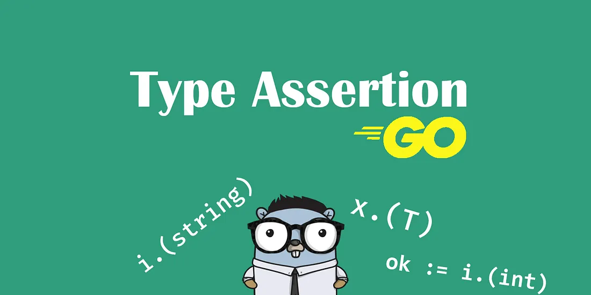

In Go programming language, assertion is a mechanism to check the dynamic type of a value during runtime. It is used to ensure that the value of a variable conforms to a certain type or interface before executing operations on it. Assertion is particularly useful when dealing with interface types, where the actual type of the underlying value is unknown.

#### Basic Assertion
In Go, basic assertion is performed using the `.` (dot) operator and the type assertion expression `x.(T)`, where `x` is the value being asserted, and `T` is the expected type. If the assertion is successful, the result is the underlying value of type `T`. If the assertion fails, a runtime error occurs.

Here is an example of basic assertion:

``` go
var i interface{} = "hello"
s := i.(string)
fmt.Println(s) // output: hello
```

In this example, we create a variable `i` of interface type and assign it the value `"hello"`. We then assert that `i` is of type `string` using the type assertion expression `i.(string)`, and assign the result to a new variable `s`. The value of `s` is now `"hello"`, and we can safely use it as a string.

#### Comma Ok Idiom
In Go, the comma ok idiom is a way to perform a safe assertion on an interface value without causing a runtime error. This is achieved by using the type assertion expression in combination with the comma ok syntax, which returns a boolean value indicating whether the assertion was successful.

Here is an example of the comma ok idiom:

``` go
var i interface{} = 42
s, ok := i.(string)
if ok {
    fmt.Println(s) // not executed
} else {
    fmt.Println("i is not a string") // output: i is not a string
}
```

In this example, we create a variable `i` of interface type and assign it the value `42`. We then use the comma ok idiom to assert that `i` is of type `string`, and assign the result to two new variables `s` and `ok`. Since `i` is not of type `string`, the value of `ok` is `false`, and we execute the `else` branch, which prints the message `"i is not a string"`.

#### Type Assertion in Struct
One common use case of type assertion is when working with structs in Go. Let’s consider an example where we have a struct called “Person” which has two fields: “name” and “age”. We can create a new instance of the Person struct and then use type assertion to access its fields.

``` go
type Person struct {
    name string
    age  int
}

func main() {
    var p interface{}
    p = Person{name: "Alice", age: 25}

    // Type assertion to access the name field
    fmt.Println(p.(Person).name)

    // Type assertion to access the age field
    fmt.Println(p.(Person).age)
}
```
In the example above, we first create an interface variable “p” and set it to an instance of the Person struct. We then use type assertion to access the “name” and “age” fields of the Person struct.

#### Type Assertion with Interfaces
Another common use case of type assertion is when working with interfaces in Go. Let’s consider an example where we have an interface called “Shape” which has a method called “Area”. We can create two structs, “Rectangle” and “Circle”, which implement the “Shape” interface, and then use type assertion to call the “Area” method.


``` go
type Shape interface {
    Area() float64
}

type Rectangle struct {
    width  float64
    height float64
}

type Circle struct {
    radius float64
}

func (r Rectangle) Area() float64 {
    return r.width * r.height
}

func (c Circle) Area() float64 {
    return math.Pi * c.radius * c.radius
}

func main() {
    var s Shape
    s = Rectangle{width: 2, height: 3}

    // Type assertion to call the Area method on the Rectangle struct
    fmt.Println(s.(Rectangle).Area())

    s = Circle{radius: 1}

    // Type assertion to call the Area method on the Circle struct
    fmt.Println(s.(Circle).Area())
}
```
In the example above, we first define the “Shape” interface and two structs, “Rectangle” and “Circle”, which implement the “Shape” interface. We then create an interface variable “s” and set it to an instance of the Rectangle struct. We use type assertion to call the “Area” method on the Rectangle struct. We then set “s” to an instance of the Circle struct and use type assertion again to call the “Area” method on the Circle struct.

#### Regular Assertion
In addition to type assertion, Go also provides regular assertion which can be used to check if an interface value is of a certain type. The syntax for regular assertion is similar to type assertion, but instead of returning the value, it returns a boolean value indicating whether the assertion succeeded or not.

``` go
var i interface{} = 42

// Regular assertion to check if i is of type int
if v, ok := i.(int); ok {
    fmt.Println("i is of type int")
} else {
    fmt.Println("i is not of type int")
}
```

In the example above, we create an interface variable “i” and set it to an integer value. We then use regular assertion to check if “i” is of type int, and print a message accordingly.

#### Type Assertion in Struct and Interface
Type assertion is also used to extract the value of an interface type into a concrete type. When we use an interface, we cannot access the fields or methods of the underlying type directly. In this case, type assertion can be used to extract the value of the underlying type and access its fields and methods.

To illustrate, let’s consider an example where we have an interface type `Animal` and two struct types `Dog` and `Cat` that implement this interface:

``` go 
type Animal interface {
    MakeSound() string
}

type Dog struct {
    Name string
}

func (d Dog) MakeSound() string {
    return "Woof!"
}

type Cat struct {
    Name string
}

func (c Cat) MakeSound() string {
    return "Meow!"
}
```

Now, let’s create a slice of `Animal` values containing both `Dog` and `Cat` instances:

``` go
animals := []Animal{Dog{"Fido"}, Cat{"Fluffy"}}
```

If we try to access the `Name` field of the `Dog` struct, we'll get a compile-time error since the `Animal` interface does not have a `Name` field. To access the `Name` field of a `Dog` instance in the `animals` slice, we need to use type assertion to extract the Dog value:

``` go
for _, animal := range animals {
    if dog, ok := animal.(Dog); ok {
        fmt.Println(dog.Name) // Output: Fido
    }
}
```
In this code, we use a type assertion to extract the `Dog` value from the `Animal` interface. The `ok` variable is a boolean that is set to true if the type assertion succeeds, and false otherwise.

It’s important to note that if we attempt to use a type assertion to extract a value of the wrong type, a runtime panic will occur. For example, if we tried to extract a `Cat` value from an `Animal` instance that contains a `Dog`, a panic would occur. Therefore, it's important to always use the `ok` variable to check if the type assertion succeeded before using the extracted value.

Type Assertion in struct and interface is a powerful feature of Go that allows us to access fields and methods of a concrete type from an interface type. However, we should use it with caution and always check the result of the assertion to avoid runtime panics.

#### Advanced Example
Type assertions can be used to perform dynamic dispatch of methods in Go. This technique is used in some cases where we want to avoid having a fixed set of methods for a type. Instead, we define a set of methods for an interface and use type assertions to dynamically determine which implementation to use. Here’s an example:

``` go
type BankAccount interface {
    Deposit(amount float64)
    Withdraw(amount float64)
}

type CheckingAccount struct {
    Balance float64
}

func (ca CheckingAccount) Deposit(amount float64) {
    ca.Balance += amount
}

func (ca CheckingAccount) Withdraw(amount float64) error {
    if amount <= 0 {
        return errors.New("invalid amount")
    }
    if ca.Balance < amount {
        return errors.New("insufficient balance")
    }
    ca.Balance -= amount
    return nil
}

func main() {
    var acc BankAccount
    acc = CheckingAccount{Balance: 100}

    // Type assertion to get the CheckingAccount specific method.
    checkingAcc, ok := acc.(CheckingAccount)
    if !ok {
        fmt.Println("Not a checking account")
        return
    }

    err := checkingAcc.Withdraw(50)
    if err != nil {
        fmt.Println("Withdrawal failed:", err)
        return
    }

    fmt.Println("New balance:", checkingAcc.Balance)
}
```
In this example, we have a CheckingAccount struct which has a Withdraw method to withdraw money from the account. We first create an Account variable and assign it a CheckingAccount instance with a balance of 100. We then use a type assertion to get the CheckingAccount specific method, which allows us to call Withdraw on the account variable.

The “comma ok” idiom is used to check if the type assertion succeeded. We store the result of the type assertion in the checkingAcc variable and a boolean value ok. If the assertion succeeded, ok will be true and we can safely call the Withdraw method. If the assertion failed, ok will be false and we know that acc is not a CheckingAccount instance.

As you can see, type assertions and the “comma ok” idiom are powerful tools in Go for working with interfaces and abstract types. With these tools, we can write flexible and reusable code that can work with a wide range of types and interfaces.

#### Pros and Cons of Type Assertion
Type assertion can be a useful tool in Go, but it’s important to consider its pros and cons before using it in your code.

##### Pros
1. Type assertion provides a way to extract a value of a specific type from an interface value.
2. It allows you to perform operations that are specific to a certain type on the value.
3. It can help you to write more concise and readable code by reducing the number of type switches that you need to write.
##### Cons
1. Type assertion can panic if the asserted type does not match the underlying type of the interface value. This can result in runtime errors that are difficult to debug.
2. It can make your code more brittle and harder to maintain if you rely too heavily on type assertions.
Overuse of type assertions can lead to less clear and less readable code.

#### Tips for Using Type Assertion
1. Always check the result of a type assertion to avoid panics.
2. Use type assertion sparingly and only when necessary.
3. Consider using type switches or interfaces instead of type assertions in cases where you need to perform different operations based on the type of a value.
4. When working with pointers, use type assertions on the pointer type rather than the value type. 
   
#### Conclusion
Type assertion is a powerful tool in Go that can be used to extract values of specific types from interface values. However, it’s important to use it judiciously and with care to avoid runtime errors and to ensure that your code remains readable and maintainable. By following best practices and being mindful of the potential pitfalls, you can make effective use of type assertion in your Go programs.

Thank you for taking the time to read this article on type assertion in Go. As a developer, it is important to have a deep understanding of the language you are using, and type assertion is a powerful tool to have in your toolkit when working with Go.

Remember to always use type assertion with caution, as it can lead to runtime errors if not used properly. Keep in mind the pros and cons we discussed and follow the tips we provided to make the most out of this feature.

Advanced Example

``` go
package main

import (
	"encoding/json"
	"fmt"
	"os"
	"strconv"
	"time"
)

// ----- User type -----
type User struct {
	Name string
}

// ----- Rich Error -----
type RichError struct {
	Message   string
	MetaData  map[string]string
	Operation string
	Time      time.Time
}

func (r RichError) Error() string {
	return r.Message
}

// ----- Simple Error -----
type SimpleError struct {
	Operation string
	Msg       string
}

func (r SimpleError) Error() string {
	return r.Msg
}

// ----- Custom Logger -----
type CustomLogger struct {
	Errors []RichError
}

func (c *CustomLogger) Append(e error) {
	if err, ok := e.(*RichError); ok {
		c.Errors = append(c.Errors, *err)
	} else if err, ok := e.(*SimpleError); ok {
		c.Errors = append(c.Errors, RichError{
			Operation: err.Operation,
			Message:   err.Msg,
			Time:      time.Now(),
			MetaData:  nil,
		})
	} else {
		c.Errors = append(c.Errors, RichError{
			Message:   e.Error(),
			MetaData:  nil,
			Operation: "unknown",
			Time:      time.Now(),
		})
	}
}
func (c *CustomLogger) AppendAndPrint(e error) {
	c.Append(e)

	fmt.Println(e.Error())
}
func (c *CustomLogger) Save() {
	f, _ := os.OpenFile("errors.log", os.O_APPEND|os.O_RDWR|os.O_CREATE, 0644)

	data, _ := json.Marshal(c.Errors)
	f.Write(data)
}

// ----- main -----

func main() {
	logger := CustomLogger{}

	//case number one
	_, fErr := findByID(0)
	if fErr != nil {
		logger.AppendAndPrint(fErr)
	}

	//case number two
	_, tErr := findUserByID(0)
	if tErr != nil {
		logger.AppendAndPrint(tErr)
	}

	//case number three
	_, oErr := os.OpenFile("da/t/sa/sd", os.O_RDONLY, 0644)
	if oErr != nil {
		logger.AppendAndPrint(oErr)
	}

	logger.Save()
}

func findByID(id int) (User, error) {
	if id <= 0 {
		return User{}, &RichError{
			Message: "id can not be 0",
			MetaData: map[string]string{
				"id": strconv.Itoa(id),
			},
			Operation: "findByID",
			Time:      time.Now(),
		}
	}

	return User{}, nil
}

func findUserByID(id int) (User, error) {
	if id <= 0 {
		return User{}, &SimpleError{
			Msg:       "simple error id can not be zero",
			Operation: "findUserByID",
		}
	}

	return User{}, nil
}
```